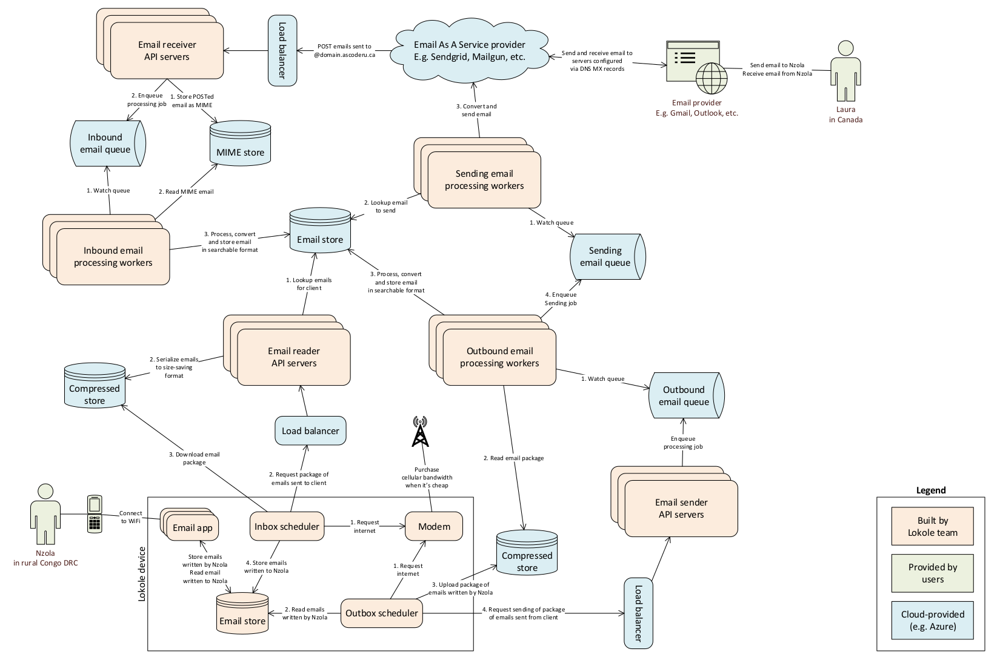

Opwen cloudserver
=================

.. image:: https://travis-ci.org/ascoderu/opwen-cloudserver.svg?branch=master
  :target: https://travis-ci.org/ascoderu/opwen-cloudserver

What's this?
------------

This repository contains the source code for the Opwen cloud server. Its purpose
is to connect the `application <https://github.com/ascoderu/opwen-webapp>`_
running on the Opwen Lokole devices to the rest of the world.

The server has two main responsibilities:

1. Receive emails from the internet that are addressed to Lokole users and
   forward them to the appropriate Lokole device.
2. Send new emails created by Lokole users to the rest of the internet.

System overview
---------------



Data exchange format
--------------------

In order to communicate between the Opwen cloud server and the Opwen
web-application (aka Lokole), a protocol based on gzipped jsonl files uploaded
to Azure Blob Storage is used. The files contains a JSON object per line.
Each JSON object describes an email, using the following schema:

.. sourcecode :: json

  {
    "sent_at": "yyyy-mm-dd HH:MM",
    "to": ["email"],
    "cc": ["email"],
    "bcc": ["email"],
    "from": "email",
    "subject": "string",
    "body": "html",
    "attachments": [{"filename": "string", "content": "base64"}]
  }

Development setup
-----------------

First, get the source code.

.. sourcecode :: sh

  git clone git@github.com:ascoderu/opwen-cloudserver.git
  cd opwen-cloudserver

Second, install the system-level dependencies using your package manager.

.. sourcecode :: sh

  sudo apt-get install -y python3-dev python3-venv openssl-dev jq
  curl -L https://aka.ms/InstallAzureCli | bash
  python3 -m pip install sfctl

Next, set up the required Azure resources and environment variables:

.. sourcecode :: sh

  # connect to Azure account
  az login
  az account set --subscription "YOUR_SUBSCRIPTION_ID_HERE"

  # define client properties
  client_name="$(whoami | tr -dC 'a-zA-Z0-9')"
  client_id="123456789"

  # create development Azure resources
  location="westus"
  resource_group="opwentest${client_name}"
  storage_name="opwenteststorage${client_name}"
  az group create -n ${resource_group} -l ${location} > /dev/null
  az storage account create -n ${storage_name} -g ${resource_group} -l ${location} --sku Standard_RAGRS > /dev/null

  # setup environment variables
  storage_key="$(az storage account keys list -n ${storage_name} -g ${resource_group} | jq -r '.[0].value')"
  cat > .env << EOF
  LOKOLE_EMAIL_SERVER_AZURE_BLOBS_NAME='${storage_name}'
  LOKOLE_EMAIL_SERVER_AZURE_QUEUES_NAME='${storage_name}'
  LOKOLE_EMAIL_SERVER_AZURE_TABLES_NAME='${storage_name}'
  LOKOLE_CLIENT_AZURE_STORAGE_NAME='${storage_name}'
  LOKOLE_EMAIL_SERVER_AZURE_BLOBS_KEY='${storage_key}'
  LOKOLE_EMAIL_SERVER_AZURE_QUEUES_KEY='${storage_key}'
  LOKOLE_EMAIL_SERVER_AZURE_TABLES_KEY='${storage_key}'
  LOKOLE_CLIENT_AZURE_STORAGE_KEY='${storage_key}'
  LOKOLE_DEFAULT_CLIENTS='[{"id":"${client_id}","domain":"${client_name}.lokole.ca"}]'
  EOF

Third, use the makefile to verify your installation by running the tests and
starting up the server. The makefile will automatically install all required
dependencies into a virtual environment.

.. sourcecode :: sh

  make tests
  make server

Alternatively, you can also run the entire application stack via Docker:

.. sourcecode :: sh

  export APP_PORT=8080
  export ENV_FILE=.env
  export BUILD_TAG=development
  docker-compose build
  docker-compose up

There are OpenAPI specifications that document the functionality of the
application and provide references to the entry points into the code
(look for "some-api-name-spec.yaml" files in the repository).

Production setup
----------------

For setting up a new deployment, run the steps below to create a new
`ServiceFabric cluster <https://docs.microsoft.com/en-us/azure/service-fabric/service-fabric-docker-compose>`_
via Docker-Compose and deploy the application across the cluster. This only
needs to be done once. After that, the cluster is wired-up with continuous
delivery via Travis so that whenever a
`new release <https://github.com/ascoderu/opwen-cloudserver/releases/new>`_
gets created on Github, the containers are automatically re-built and
deployed to the cluster.

.. sourcecode :: sh

  location='eastus'
  name='opwenserver'
  deploy_tag='latest'
  cert_folder="$(mktemp -d)"
  cluster_size='5'
  vm_size='Standard_B2S'

  deploy_password="FILL ME IN"
  appinsights_key="SET ME"

  # create required resources
  az configure --defaults group="${name}" location="${location}"
  az group create --name="${name}"
  az storage account create --sku=standard_lrs --name="opwenserverqueues"
  az storage account create --sku=standard_lrs --name="opwenservertables"
  az storage account create --sku=standard_lrs --name="opwenserverblobs"
  az storage account create --sku=standard_lrs --name="opwenclientblobs"

  # fetch access keys
  queues_key=$(az storage account keys list --account-name="opwenserverqueues" | jq -r ".[0].value")
  tables_key=$(az storage account keys list --account-name="opwenservertables" | jq -r ".[0].value")
  blobs_key=$(az storage account keys list --account-name="opwenserverblobs" | jq -r ".[0].value")
  clients_key=$(az storage account keys list --account-name="opwenclientblobs" | jq -r ".[0].value")

  # build the containers to be deployed
  cat > .env << EOF
    LOKOLE_EMAIL_SERVER_APPINSIGHTS_KEY="${appinsights_key}"
    LOKOLE_EMAIL_SERVER_AZURE_QUEUES_NAME="opwenserverqueues"
    LOKOLE_EMAIL_SERVER_AZURE_QUEUES_KEY="${queues_key}"
    LOKOLE_EMAIL_SERVER_AZURE_TABLES_NAME="opwenservertables"
    LOKOLE_EMAIL_SERVER_AZURE_TABLES_KEY="${tables_key}"
    LOKOLE_EMAIL_SERVER_AZURE_BLOBS_NAME="opwenserverblobs"
    LOKOLE_EMAIL_SERVER_AZURE_BLOBS_KEY="${blobs_key}"
    LOKOLE_CLIENT_AZURE_STORAGE_NAME="opwenclientblobs"
    LOKOLE_CLIENT_AZURE_STORAGE_KEY="${clients_key}"
  EOF
  APP_PORT=80 ENV_FILE=.env BUILD_TAG="$deploy_tag" docker-compose config > compose.yml
  docker-compose -f compose.yml push

  # create a new cluster
  cluster_host="$name.$location.cloudapp.azure.com"
  az sf cluster create \
    --resource-group "$name" --location "$location" --certificate-output-folder "$cert_folder" \
    --certificate-password "$deploy_password" --certificate-subject-name "$cluster_host" \
    --cluster-name "$name" --cluster-size "$cluster_size" --os UbuntuServer1604 \
    --vault-name "$name" --vault-resource-group "$name" \
    --vm-password "$deploy_password" --vm-user-name "$name" --vm-sku "$vm_size"

  # deploy the containers for the application to the cluster
  cert_file="$(ls $cert_folder/*.pem | head -1)"
  REQUESTS_CA_BUNDLE="$cert_file" sfctl cluster select --endpoint "https://$cluster_host:19080" --pem "$cert_file" --no-verify
  sfctl compose create --deployment-name "$name" --file-path compose.yml

  # log some information about the deployment
  echo "All done. Keep the following for your records:"
  echo "- Cluster URL: http://$cluster_host"
  echo "- Certificate: $cert_file"

If you're setting up a new continuous delivery integration, make sure to
update the secrets archive in Travis to include your cluster certificate
and environment dotfile since the items included in this repository are
specific to the Ascoderu deployment of this repository. For more information,
take a look at how to
`encrypt files with Travis <https://docs.travis-ci.com/user/encrypting-files/>`_.

How do I...
-----------

... test the receiving of an email from an external entity like Outlook?
````````````````````````````````````````````````````````````````````````

.. sourcecode :: sh

  # start the server and the worker that processes inbound emails
  make server &
  make inbound-store-worker &

  # simulate the Sendgrid service forwarding an email received at the Lokole MX
  # records to this service
  # the server will receive the request from Sendgrid and enqueue a message to
  # process and ingest the newly received raw MIME email
  # the inbound-store-worker then wakes up, parses the MIME email into a domain
  # object and stores it in the email datastore
  curl localhost:8080/api/email/sendgrid/YOUR_CLIENT_ID_HERE -F "email=YOUR_MIME_EMAIL_HERE"

... test the Lokole devices uploading emails written on them?
`````````````````````````````````````````````````````````````

.. sourcecode :: sh

  # start the server and the workers that process outbound emails
  make server &
  make outbound-store-worker &
  make outbound-send-worker &

  # create and upload a compressed emails package to Azure just like the Lokole
  cat "YOUR_EMAIL_DATA_HERE" > emailsFromLokole.pack
  az storage blob upload -f emailsFromLokole.pack -c compressedpackages -n test-resource-id --account-name "YOUR_ACCOUNT_NAME_HERE" --account-key "YOUR_KEY_HERE"

  # simulate the Lokole device's upload phase of the sync cycle calling out to
  # the service
  # the server will receive the Lokole's upload request and enqueue a message to
  # process and ingest the uploaded emails
  # the outbound-store-worker then wakes up, retrieves the uploaded emails from
  # Azure, stores them in the email datastore and enqueues another message to
  # send the emails to their recipients
  # the outbound-send-worker then wakes up, retrieves each email to be sent,
  # formats it into a MIME email and shoots it off to Sendgrid for delivery
  curl localhost:8080/api/email/lokole/YOUR_CLIENT_ID_HERE -X POST -d '{"resource_container":"compressedpackages","resource_id":"test-resource-id","resource_type":"azure-blob"}' -H "Content-Type: application/json"

... test the Lokole devices downloading emails sent to them?
````````````````````````````````````````````````````````````

.. sourcecode :: sh

  # start the server
  make server &

  # simulate the Lokole device's download phase of the sync cycle calling out to
  # the service
  # the server will receive the Lokole's download request, fetch all the new
  # messages sent to the Lokole device since the last request, package them and
  # upload them to Azure
  resource_id=$(curl localhost:8080/api/email/lokole/YOUR_CLIENT_ID_HERE -X GET | jq -r '.resource_id')

  # download the compressed emails package that the Lokole device would ingest
  az storage blob download -f emailsToLokole.pack -c compressedpackages -n ${resource_id} --account-name "YOUR_ACCOUNT_NAME_HERE" --account-key "YOUR_KEY_HERE"
